# Get취미 - 취미 큐레이션/동영상 강의 사이트
-----

# 개요
* 프로젝트 명 : Get취미 

* 일정 : 2019.12.24 ~ 2020.03.12 (두달) 

* 팀 구성 : 김지민(조장), 김태우, 최하경, 이한솔, 이태곤

* 시스템 개요 : 
최근 나만의 시간을 중요시하고 인생을 즐기려는 현대인들이 늘어남에 따라 YOLO, 소확행, 워라벨
등의 가치관이 확산되고 하나의 트렌드를 형성하였고 이에 자연스럽게 취미에 대한 관심도 증대되었다.
또한, 유투브와 같은 OTT시장 규모가 꾸준히 증가하고 1인 크리에이터 산업이 확대되었다.
이러한 확산 배경에 발맞춰 Get취미는 취미 큐레이션 및 재능연결 동영상플랫폼을 서비스한다. 

* 사용 기술 및 개발환경
   - O/S : Windows 10 
   - Front-end : HTML, CSS, Javascript, jQuery, AJAX, BootStrap, summernote, FullCalendar, sweetalert2, 
   Owl-Carousel 2, HighChart, Masonry, Video.js
   - Back-end : Java, Spring Framework, Apache Tomcat 7, Orcale 10g, MyBatis, JavaMail API, node.js, npm, express, fluent-FFmpeg  
   - Programming Language : JAVA(JDK 1.8), HTML, JavaScript 
   - Open API : Kakao Developer, Naver Developer, 다음 우편번호 찾기 API, 스마트택배 API, 청기와랩 API, 
   I'MPORT API, 채널톡
   - Tool : Github, StarUML, SQL Developer, Eclipse, Visual Studio Code, OvenApp, FFmpeg, OpenSSL    

# 내용
* 자료
	- [발표 PPT(Slideshare)](https://www.slideshare.net/secret/DUE58PqoBENXdU)
	- [개인 포트폴리오(Slideshare)](https://www.slideshare.net/secret/7CahEX2kbv7spb) 
	- [Get취미 발표영상](https://www.youtube.com/watch?v=k_PnSZcXUz8)
	- [개인파트 발표영상](https://www.youtube.com/watch?v=SpeajSjDC8U&feature=youtu.be)
	- [전체 동작영상](https://www.youtube.com/watch?v=fTofMrUJzwc&t=2s)
	- [개인파트 동작영상](https://www.youtube.com/watch?v=1VEgMq3sTBU)
	- [프로젝트보고서(구글드라이브)](https://drive.google.com/open?id=1phe4cjKpaJZHDCttEMvFWDUhE9NpWCO4)
* 구현 기능
   - 로그인
   - 회원가입(네이버, 다음) 
   - 커뮤니티(자유게시판, 사진게시판, 클래스 커뮤니티, 댓글)
   - 마이페이지(회원 정보, 구매내역, 클래스 일정, 수강중인 클래스, 최근에 본 클래스, 찜한 클래스)
   - 클래스 검색(카테고리, 해쉬태그, 검색조건, 키워드)
   - 클래스 강의(Progressive Download, HTTP Live Streaming, 이어보기, 진행률, 댓글) 
   - 클래스 통계(수강생 성별, 연령대)
   - 커뮤니티 검색(검색조건, 키워드)
   - 클래스 구매(핸드폰 소액결제, 카드결제)
   - 관리자 페이지(회원 관리, 클래스 관리, 이벤트 관리, 구매 관리, 신고 관리, 공지 관리, 수익 관리)
   - 메인화면(사이트 소개, 인기 클래스, 수요조사 중인 클래스, 추천 클래스, 전체 클래스 auto scroll)

* 팀원별 역할
   - 김지민(팀장) : 클래스 검색, 클래스 강의, 내 클래스, 신고 관리, 이벤트 관리
   - 최하경 : 클래스 커뮤니티, 이벤트 관리
   - 김태우 : 회원 관리, 공지 관리
   - 이태곤 : 클래스 개설, 클래스 관리, 구매 관리, 수익 관리   
   - 이한솔 : 자유게시판, 사진게시판, 배송 관리 

* 폴더 구조
   - src/main/java
     * 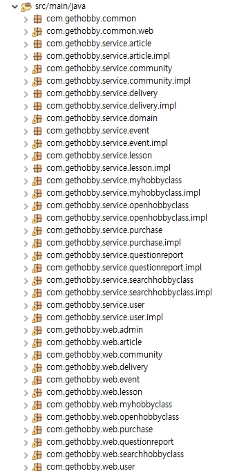

   - src/main/resources
     -  

   - src/tset/java
     - 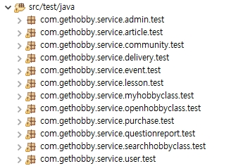 

   - WebContent
     - 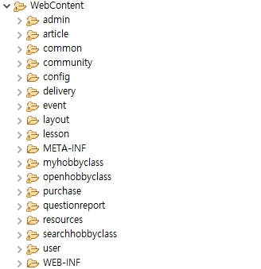 

* 산출물(대표)
   - 분석 
      - 현업요구사항정의서
		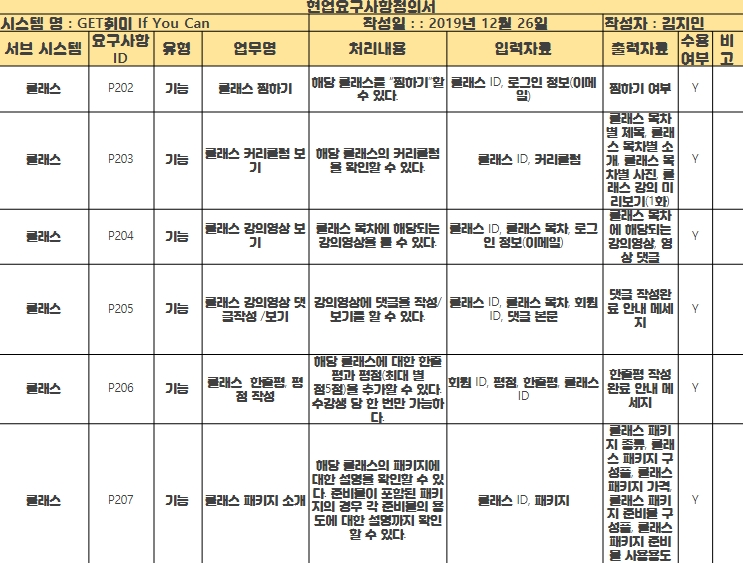
      - UseCase 정의서
		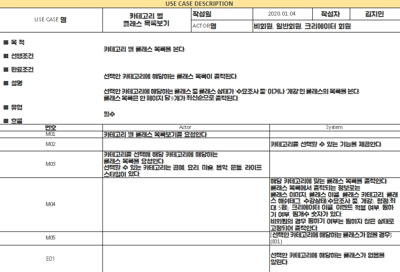
      - UseCase 유형정의서
		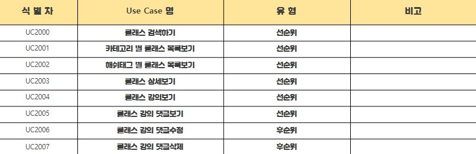
      - 요구사항추적표
		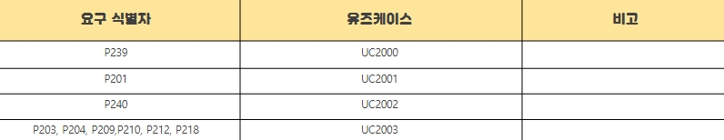
      - UseCase Diagram  
		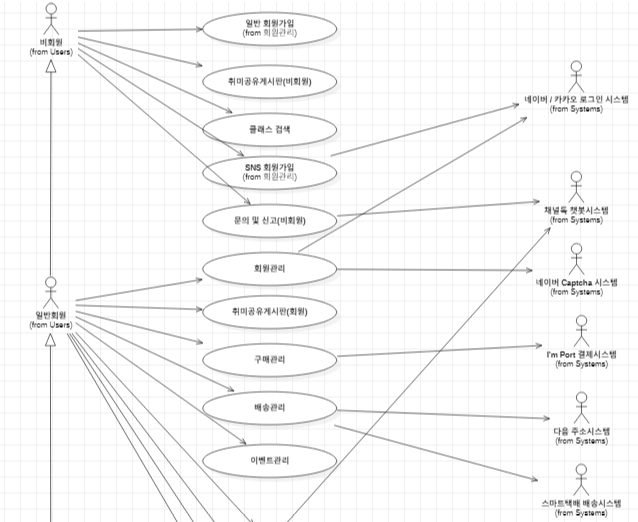
      - Class Diagram
		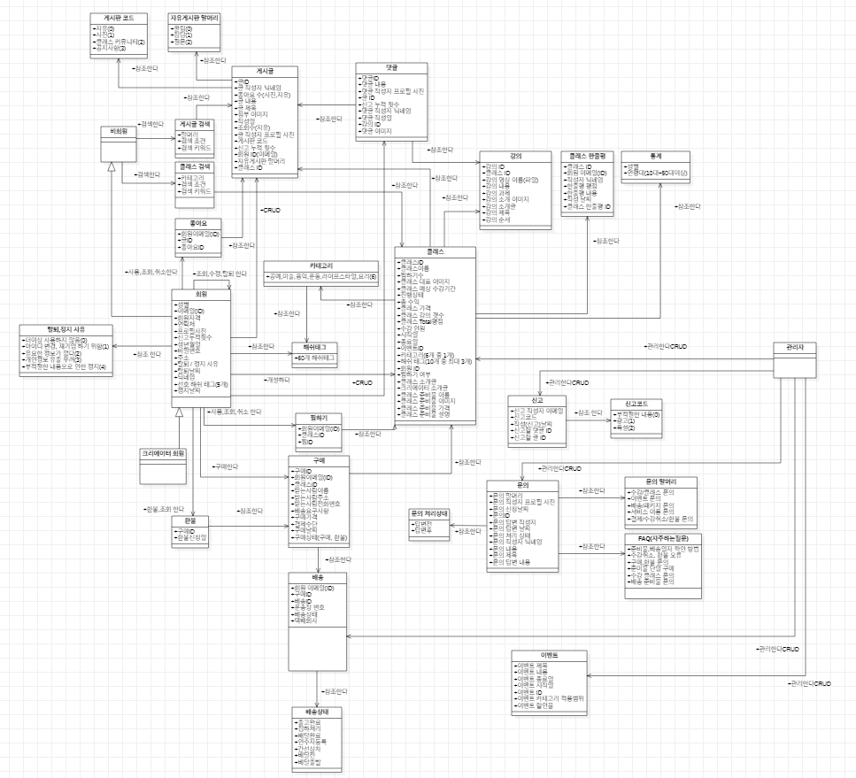
      - VOPC
		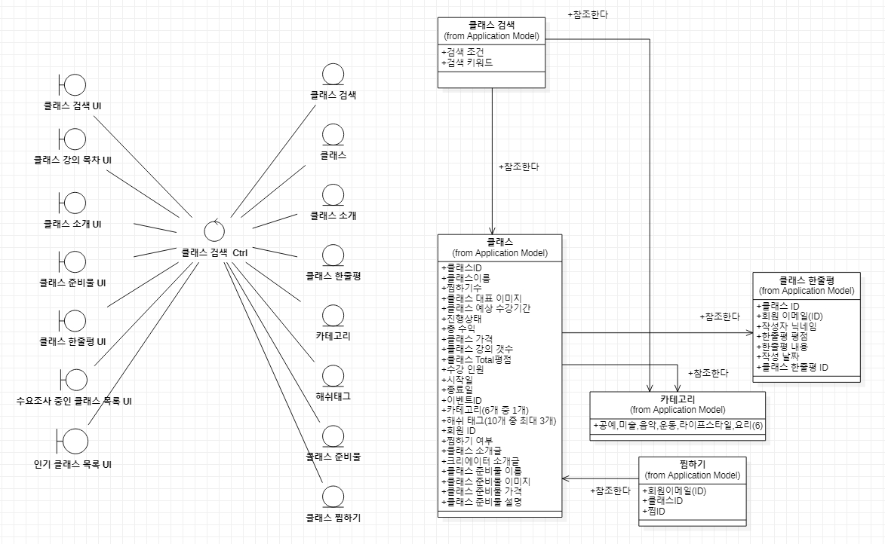
      - 화면정의서  
		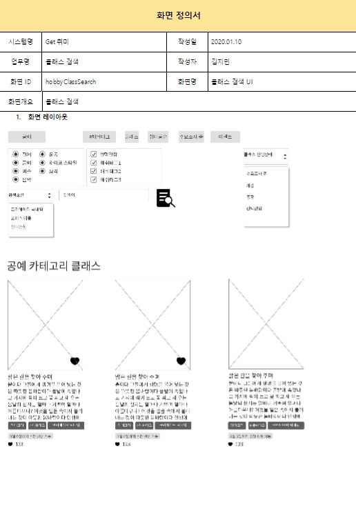
		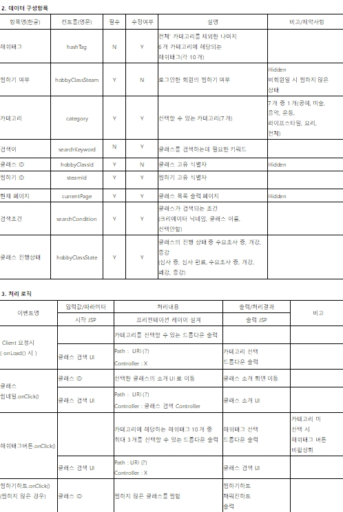
		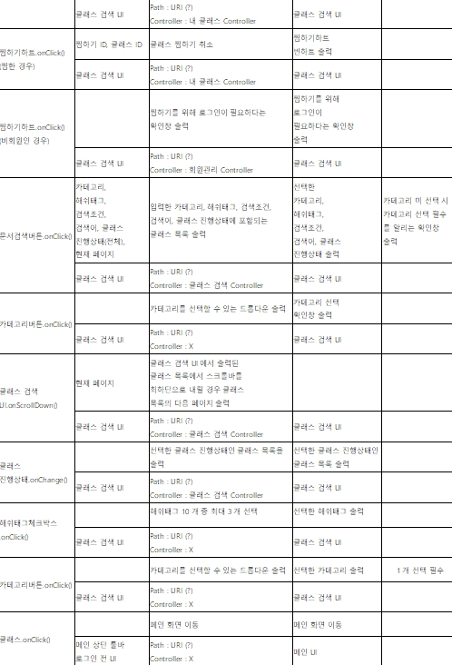
      - ERD(Logical)
		.jpg)
   - 설계
     - VOPC
		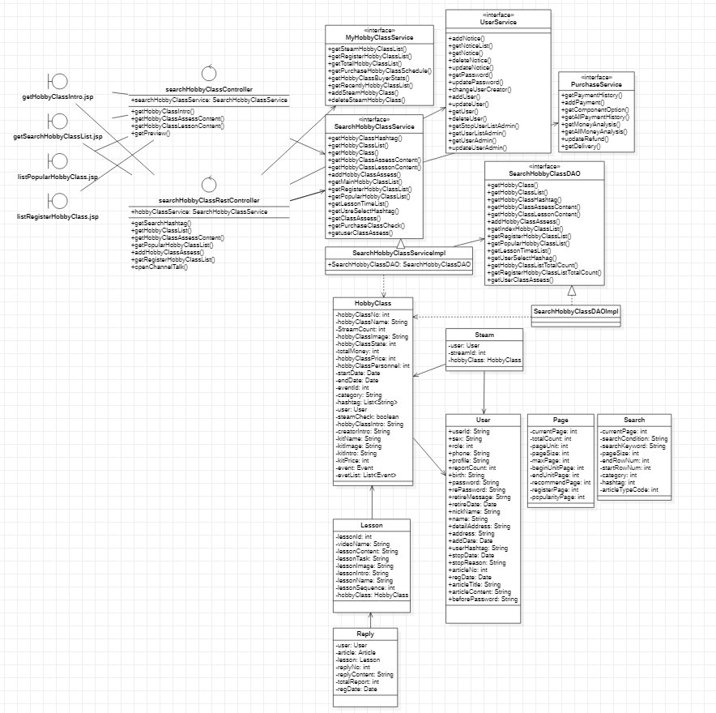
     - 화면 정의서  
		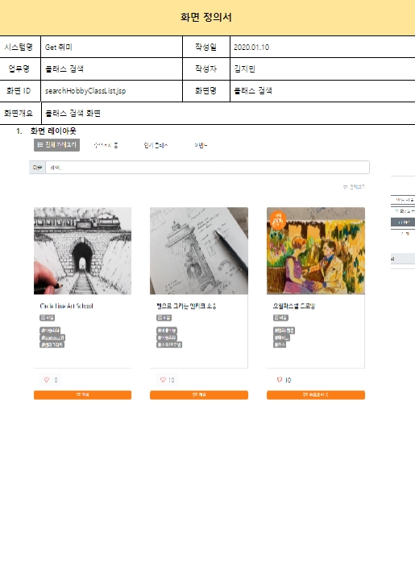
		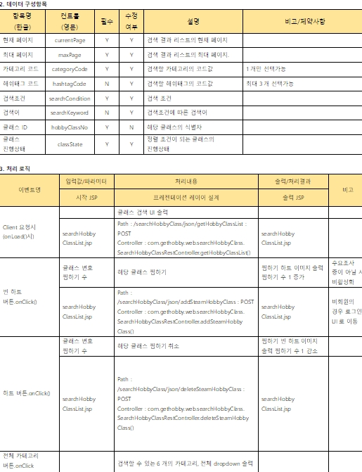
		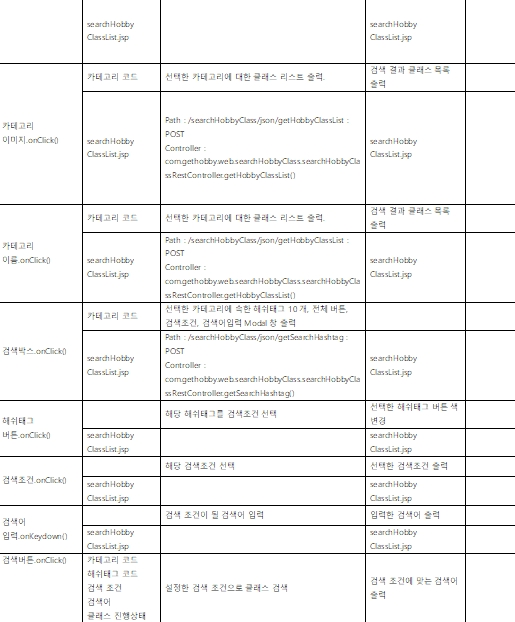
		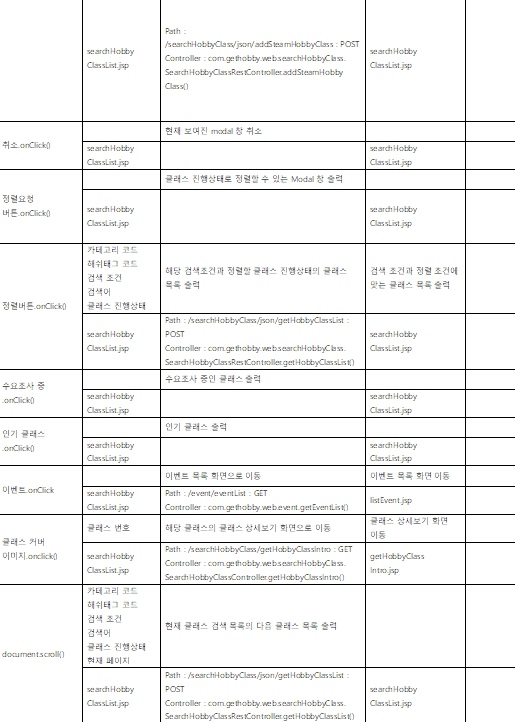
     - ERD(Physical)
		.png)
     - 테이블정의서
		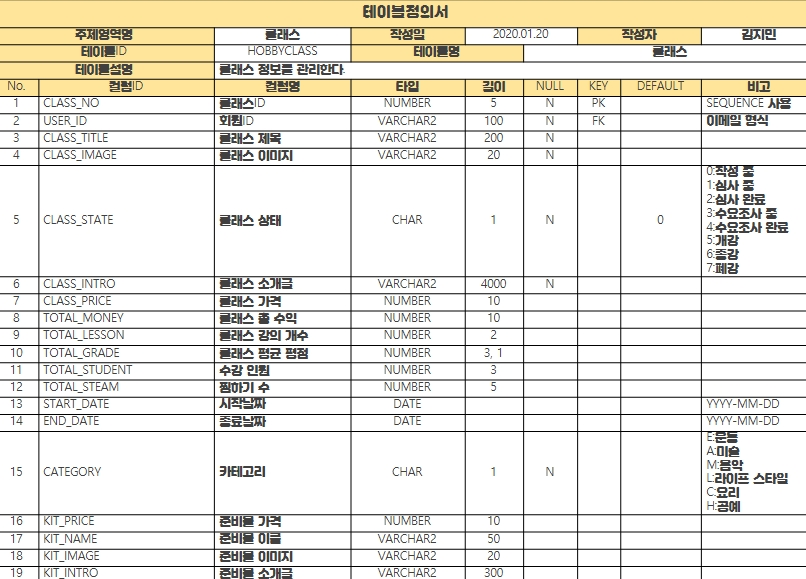
        
감사합니다.